# Motion_Planning_Projects

This project implements various search based planners (**Dijsktra, A star, D star**) and sampling-based planners(**RRT, RRT star and Informed RRT star**).The planners are
implemented on a 2d map. The map is given as input in the .csv format in the matrix form where '0' value corresponds to free location and '1' value 
corresponds to object location. Each of the folder contains *main.py* file which is responsible for executing the code. The output folder contains the output from the algorithm
as the image file showing the map and the resultant path. To run any of the algorithm, download the corresponding folder and run 
*python3 main.py*. The map can be changed by chaning the values in the .csv file. 

## Resultant path from search based planners:
### Dijkstra
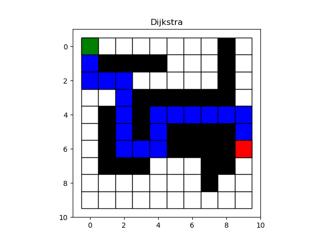
### A*
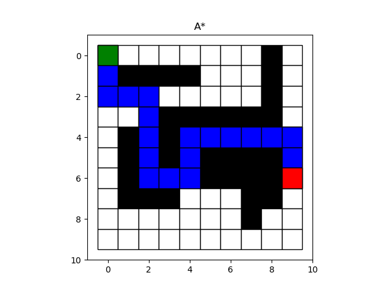
### D* static path
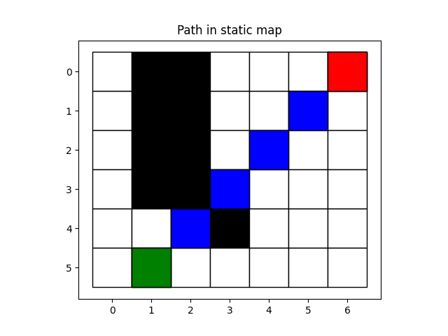
### D* dynamic path
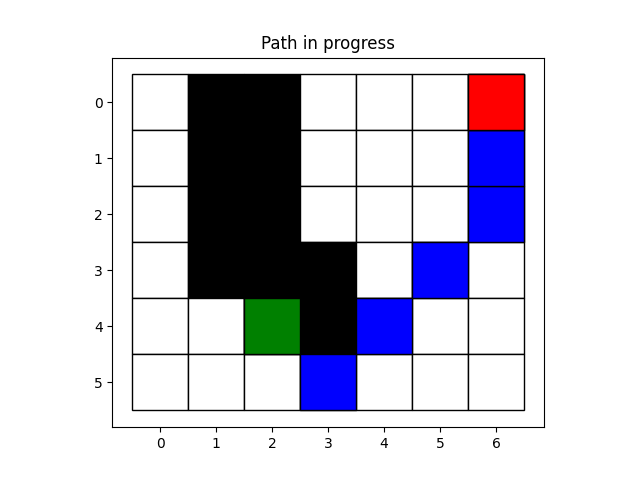
## Resultant path from sampling based planners:
### RRT
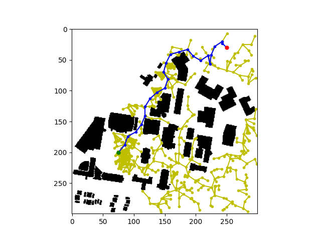
### RRT*
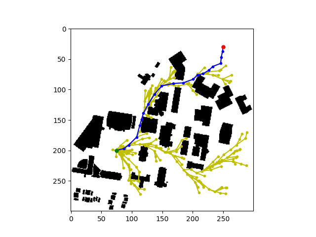

### PRM bridge planner
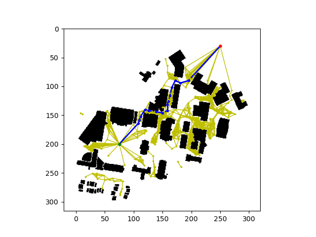
### PRM gaussian planner
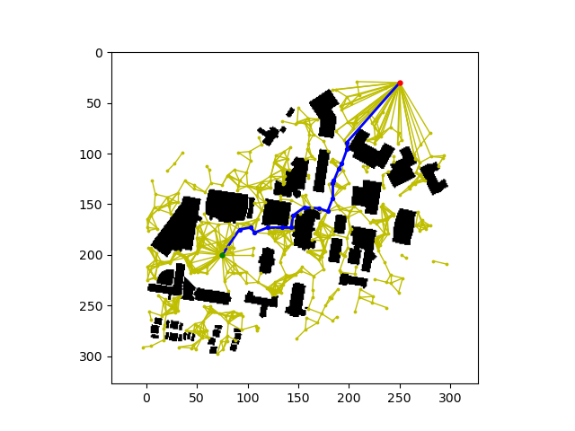
### PRM random planner
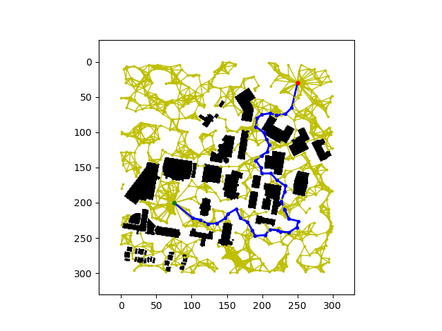
### PRM uniform planner
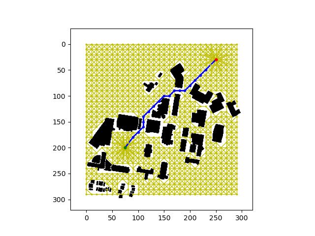
### Informed RRT*
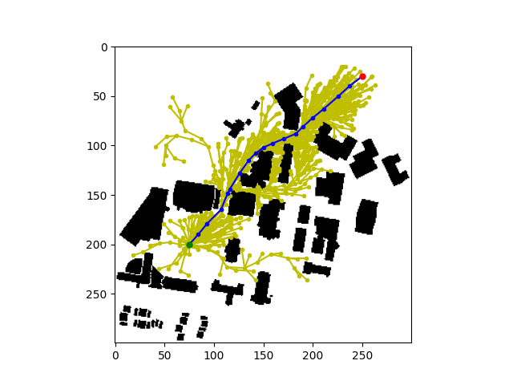

